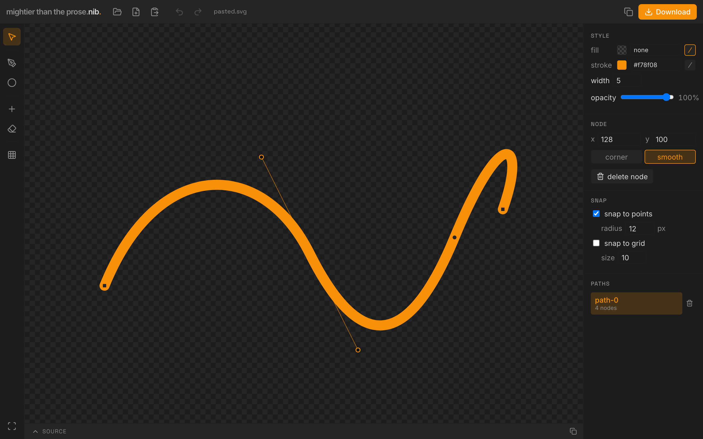

# nib

> mightier than the prose.

<p align="center">
  
</p>

A small, direct-manipulation **SVG path editor**. LLMs are great at roughing out
an SVG but hopeless to *finetune* by prose — "nudge that node left, close the
loop" doesn't work in words. nib closes that gap: open the SVG, grab the actual
anchor points and bezier handles, drag them, snap endpoints together to close
loops, save back.

Point it at a **folder** of generated SVGs, refine each, save in place.

## Phase 0

- Open a folder of SVGs (or paste text / open a single file / drag a file in).
- Drag anchor points and bezier control handles; smooth vs corner nodes.
- **Move a whole shape** by dragging its body (select tool); a node drag moves
  just that node.
- **Scale a shape** by dragging its selection-box handles (corners = both axes,
  edges = one; Shift keeps aspect).
- **Draw new paths** with the pen (click for corners, drag for curves, click the
  start to close) — from a blank canvas or on top of a loaded SVG.
- **Draw a circle** (drag from centre, snaps to grid) — an editable closed path.
- **Style any path** (drawn or imported): fill / stroke colour, stroke width,
  opacity — imported paths are rewritten surgically, rest of the tag preserved.
- Add a node on a segment; delete a node.
- **Paths list**: rename (double-click) and delete (trashcan) paths.
- **Edit the SVG source directly** (SOURCE drawer) — re-parses, and bad markup
  is rejected without losing your document.
- **Close a loop by snapping** an endpoint onto the subpath's start.
- Zoom/pan, undo/redo.
- Save back in place (or download); live SVG source view + copy.

Unedited markup is preserved byte-for-byte — only the paths you touch are rewritten.

## Shortcuts

- `V` select · `P` pen · `C` circle · `A` add-node · `D` delete-node
- **Shift** while dragging → constrain to an axis
- **Arrows** nudge the selection (1 unit; **Shift** = 10)
- `⌘/Ctrl+C/V/X` copy / paste / cut · `⌘/Ctrl+D` duplicate
- `⌘/Ctrl+Z` undo · `⇧⌘Z` redo · `Delete` remove selected node/path
- **Esc** back to the select tool (finishes a pen path) · `0` fit to view
- **Space**-drag or middle-drag to pan · wheel to zoom

## Develop

```
just dev        # dev server at http://localhost:5173
just validate   # typecheck + lint + format
just test       # unit tests
just build      # production build → frontend/dist
```

Fully client-side (SvelteKit SPA). **Folder open/save is Chromium-only** (File
System Access API); the paste / open-file / download fallbacks work everywhere.

See [`CLAUDE.md`](./CLAUDE.md) for architecture and the `nib-design` skill for
the visual identity.
